# GEF Classic 3.15.0 (Eclipse 2022-12)

##General
 - Code clean-up and reduced deprecated code usage
 - Rreduced dependencies to com.ibm.icu.text package

##Draw2d
 - Common ZoomManager code from GEF and ZEST was moved to Draw2d to reduce code duplication
 - Introduction of ZoomScrollPolicies allowing to configure how the ZoomManager will scroll after zooming
 - New MouseLocationZoomScrollPolicy which maintains the content under the mouse during zooming
 - Fixed thumbnailing for Mac OS
 - Fixed unwanted drawing artifacts that could occur during drag operations

##GEF
 - Clients can now provide their own marquee selection figure 
 - Fixed resizing from left or top: When reaching minimum size it moved the element
 
## Zest
 - Improved scroll performance on ZEST
 - Enable custom graph nodes and connections

# GEF Classic 3.14.0 (Eclipse 2022-06)

GEF-Legacy was revived as GEF Classic. This first reactivation release contains "only" the upgrade to Java 11.

# [GEF 4.0.0 (Neon)](https://projects.eclipse.org/projects/tools.gef/releases/4.0.0-neon)

Annual release providing minor revisions of the GEF-Legacy components Draw2d 3.x (3.11.0), GEF (MVC) 3.x (3.11.0), and Zest 1.x (1.7.0). As the new GEF4 components were graduated as production components in version 1.0.0 with this release, the GEF-Legacy components have been put into pure maintenance mode, i.e. annual service releases will be provided for critical fixes or in case patches are provided by the community.

# [GEF 3.10.1 (Mars.1)](https://projects.eclipse.org/projects/tools.gef/releases/3.10.1-mars.1)

## General

The GEF 3.10.1 (Mars SR1) release provides service revisions of the production components Draw2d 3.x (3.10.1), GEF (MVC) 3.x (3.10.1), and Zest 1.x (1.6.1).

# [GEF 3.10.0 (Mars)](https://projects.eclipse.org/projects/tools.gef/releases/3.10.0-mars)

## General

The GEF 3.10.0 (Mars) release provides minor releases for the Draw2d 3.x (3.10.0), GEF (MVC) 3.x (3.10.0), and Zest 1.x (1.6.0) components, as well as a first snapshot release (0.1.0).

## Draw2d 3.10.0

Only minor changes have been applied to the Draw2d 3.x production component, which is in maintenance mode.

### Tooltip Delay (3.10.0 M1)

TooltipHelper now allows clients to set the tooltip delay (see Bug [#323656](https://bugs.eclipse.org/bugs/show_bug.cgi?id=323656)).

## GEF (MVC) 3.10.0

Only minor changes have been applied to the GEF (MVC) 3.x production component, which is in maintenance mode.

### Redoing Commands (M2)

Added Command#canRedo(), which by default delegates to Command#canExecute() but can be overwritten to decide whether a command is redoable or not. The CommandStack now evaluates this when checking of the command on its top can be redone (CommandStack#canRedo()) (see Bug [#332351](https://bugs.eclipse.org/bugs/show_bug.cgi?id=332351)).

## Zest 1.6.0

Only minor changes have been applied to the Zest 1.x production component, which is in maintenance mode.

# [GEF 3.9.0 (Kepler)](https://projects.eclipse.org/projects/tools.gef/releases/3.9.0-kepler)

## Zest

### Zest 1.x Reference Documentation (M4)

Zest reference documentation is now provided in terms of a org.eclipse.zest.doc.isv plug-in, which contributes the API reference and an initial developer guide (an extract of the old Zest 1.x wiki page) to the GEF developer guide (formerly known as GEF and Draw2d Plug-in Developer Guide). See Bug [#394137](https://bugs.eclipse.org/bugs/show_bug.cgi?id=394137) for details.

# [GEF 3.8.0 (Juno)](https://projects.eclipse.org/projects/tools.gef/releases/3.8.0-9)

## General

### CBI-Compliant Infrastructure

The major concern of the 3.8 release has been to modernize the rather outdated release engineering infrastructure of GEF and make it suitable for a CBI scenario. That is, the GEF cvs repository has been migrated to Git (see Bug [#351232](https://bugs.eclipse.org/bugs/show_bug.cgi?id=351232) for details) and the CI build system has been migrated from the outdated common modeling build infrastructure to Tycho/Hudson (see Bug [#363394](https://bugs.eclipse.org/bugs/show_bug.cgi?id=363394) for details). As a result of this migration, the repository has been cleaned up (old projects were removed) and several build-related problems have been ruled out as well (e.g. missing javadocs). Furthermore, the update-sites have been re-created and the web contents (downloads page) has been updated accordingly.

### GEF 4 Provisional Component

The second major concern during the 3.8 release period was the initiation of a GEF4 provisional component. While up to the 3.8 release, work has been spent on creating a new double-precsision Geometry API (see Bug [#355997](https://bugs.eclipse.org/bugs/show_bug.cgi?id=355997) for details), plans are to port the remaining parts of the Draw2d and GEF (MVC) 3.8 code base to after the Juno release, as well as the up to now independently developed Zest2 code base (see Bug [#372365](https://bugs.eclipse.org/bugs/show_bug.cgi?id=372365) for details).

# [GEF 3.7.0 (Indigo)](https://projects.eclipse.org/projects/tools.gef/releases/3.7.0-indigo)

## General

### Improved Mac OS X compatibility (M3, M4, M5, M6)

Special focus has been spent on resolving Mac specific inconsistencies. While some issues (e.g. proper key bindings) could be resolved directly within Draw2d/GEF, most of the problems were caused by underlying SWT inconsistencies, which were (identified by the GEF team and) resolved by the SWT team. Most notably, XOR painting mode is now supported by SWT on Mac Cocoa, which was the root cause for several issues on this platform, e.g. the incorrect painting of feedback figures.

Even while this has not been enforced via plug-in dependencies, it is thus recommended to use GEF 3.7 in combination with SWT/Eclipse 3.7, because you will not profit from these fixes otherwise. See bugzilla for a complete list of all Mac-specific issues that are resolved in 3.7.

## Draw2d

### Refactoring of Geometry API (M4)

Geometry API was refactored to guarantee consistency between integer-precision and double-precision version of Point/PrecisionPoint, Dimension/PrecisionDimension, and Rectangle/PrecisionRectangle. Synchronization between the still exposed integer-precision fields (x, y, width, height) and the no-longer exposed double-precision fields (preciseX, preciseY, preciseWidth, preciseHeight) is performed automatically by precision classes now, so clients may use the precision versions transparently, being no longer forced to perform a manual update of the respective fields. See Bugs [#124904](https://bugs.eclipse.org/bugs/show_bug.cgi?id=124904), [#142628](https://bugs.eclipse.org/bugs/show_bug.cgi?id=142628), and [#271235](https://bugs.eclipse.org/bugs/show_bug.cgi?id=271235) for details.

### Refactoring of FlowLayout and ToolbarLayout (M5)

OrderedLayout was introduced as a new common superclass of FlowLayout and ToolbarLayout. As a consequence, FlowLayoutEditPolicy could be generalized and may now work with OrderedLayout, being no longer restricted to FlowLayout based figures alone. See Bug [#88884](https://bugs.eclipse.org/bugs/show_bug.cgi?id=88884) for details.

## GEF

### Refactoring of LayoutEditPolicy, ConstrainedLayoutEditPolicy, and XYLayoutEditPolicy (M4)

Layout edit policies have been refactored to remove duplicate code and allow better extensibility.

 - LayoutEditPolicy was enhanced by adding methods relevant for translations, used in all layout edit policies (removed duplicate code from subclasses):
   - Added getLayoutOrigin()(pulled up from ConstrainedLayoutEditPolicy)
   - Added translateFromAbsoluteToLayoutRelative(Translatable t) (synthesized from duplicated code spread throughout different layout edit policies)
   - Added translateFromLayoutRelativeToAbsolute(Translatable t) (synthesized from duplicated code spread throughout different layout edit policies)
 - ConstrainedLayoutEditPolicy was changed as follows:
   - Added createAddCommand(ChangeBoundsRequest request, EditPart child, Object constraint) as a replacement for createAddCommand(EditPart child, Object constraint), which was in turn deprecated (this is now handled similar as in case of change constraint commands).
   - Made createChangeConstraintCommand(EditPart child, Object constraint) concrete (empty body) and deprecated it to indicate that clients should instead createChangeConstraintCommand(ChangeBoundsRequest request, EditPart child, Object constraint)
   - Added getConstraintFor(Request request, GraphicalEditPart child, Rectangle rectangle), which subsumes the duplicate code fragments located in getConstraintFor(ChangeBoundsRequest request, GraphicalEditPart child) and getConstraintFor(CreateRequest request) before (both of these methods now delegate to the new method).
 - XYLayoutEditPolicy was changed as follows:
   - Replaced overwritten version of getConstraintFor(ChangeBoundsRequest request, GraphicalEditPart child) with an overwritten version of the newly introduced getConstraintFor(Request request, GraphicalEditPart child, Rectangle rect).

See Bug [#320852](https://bugs.eclipse.org/bugs/show_bug.cgi?id=320852) for details.

### Refactoring of Primary Drag Edit Policies (M4)

Primary drag edit policies were refactored to allow clients to easier provide custom handles and related select/drag/resize trackers.

 - NonResizableEditPolicy was changed by introducing hook methods to allow clients to customize the creation of handles and drag/select trackers used by them:
   - Added createDragHandle(List handles, int direction)
   - Added createMoveHandle(List handles, int direction)
   - Added createDragTracker(), which is used by createDragHandle(List handles, int direction) to construct the drag tracker for the created drag handle.
   - Added createSelectTracker(), which is used by createMoveHandle(List handles, int direction) to construct the select tracker for the created move handle.
 - ResizableEditPolicy was similarly changed by introducing the following methods:
   - Added createResizeHandle(List handles, int direction)
   - Added createResizeTracker(int), which is used by createResizeHandle(List handles, int direction) to create the resize tracker for the constructed resize handle.

The refactoring was performed in combination with the enhancement of ResizeTracker and CreationTool with support for constraints on resize and size-on-drop. See Bug [#67541](https://bugs.eclipse.org/bugs/show_bug.cgi?id=67541) for details.

### Enhancement of ResizeTracker and CreationTool (M4)

Extended ResizeTracker and CreationTool so that they now offer means to enforce certain constraints (by default, minimum and maximum size constraints) during resize as well as size-on-drop (dragging during creation). This was realized by adding methods to enforce size constraints:

 - ResizeTracker#enforceConstraintsForResize(ChangeBoundsRequest)
 - CreationTool#enforceConstraintsForSizeOnDropCreate(CreateRequest)

which are called whenever the source respectively target request is updated. By default, both ensure that minimum and maximum size constraints, which are inferred via respective hook methods:

 - ResizeTracker#getMaximumSizeFor(ChangeBoundsRequest)
 - ResizeTracker#getMinimumSizeFor(ChangeBoundsRequest)
 - CreationTool#getMaximumSizeFor(CreateRequest)
 - CreationTool#getMinimumSizeFor(CreateRequest)

Clients may overwrite the respective hook methods to infer maximum and minimum sizes for certain requests, or overwrite and adjust the enforcement of constraints as a whole (in case additional constraints have to be ensured). While the CreationTool could already be easily exchanged with a customized subclass by specifying a tool class upon construction of a CreationToolEntry, the ResizableEditPolicy was now enhanced to allow clients to specify a custom ResizeTracker as well, which will be used for all resize handles.

The logic example was enhanced to demonstrate how the new features can be used. See Bug [#67541](https://bugs.eclipse.org/bugs/show_bug.cgi?id=67541) for details.

### Enhancement of MarqueeSelectionTool (M4)

MarqueeSelectionTool was enhanced to now offer the following default marquee behaviors:

 - BEHAVIOR_CONNECTIONS_TOUCHED (supported since 3.1)
 - BEHAVIOR_CONNECTIONS_CONTAINED
 - BEHAVIOR_NODES_TOUCHED
 - BEHAVIOR_NODES_CONTAINED (supported since 3.1, default behavior)
 - BEHAVIOR_NODES_TOUCHED_AND_RELATED_CONNECTIONS
 - BEHAVIOR_NODES_CONTAINED_AND_RELATED_CONNECTIONS (supported since 3.1, formerly known as BEHAVIOR_NODES_AND_CONNECTIONS, which was in turn deprecated).

It was furthermore refactored to allow clients to customize marquee selection behavior via subclassing and overwriting one or more of the following methods:

 - performMarqueeSelect()
 - calculateMarqueeSelectedEditParts()
 - isMarqueeSelectable(EditPart)

The following methods are now also exposed (protected visibility) so clients can use access the current tool mode and the selection rectangle in their customization code:

 - getCurrentMarqueeSelectionRectangle()
 - getCurrentSelectionMode()

The logic example was enhanced to demonstrate all new marquee behaviors. See Bug [#67991](https://bugs.eclipse.org/bugs/show_bug.cgi?id=67991) for details.

### Enhancement of MarqueeToolEntry (M4)

MarqueeToolEntry has been enhanced to use different icons dependent on the marquee behavior of the tool.

 - MarqueeEntry Nodes.png BEHAVIOR_NODE_TOUCHED and BEHAVIOR_NODES_CONTAINED
 - MarqueeEntry Connections.png BEHAVIOR_CONNECTIONS_TOUCHED and BEHAVIOR_CONNECTIONS_CONTAINED
 - MarqueeEntry Nodes and Connections.png BEHAVIOR_NODES_TOUCHED_AND_RELATED_CONNECTIONS and BEHAVIOR_NODES_CONTAINED_AND_RELATED_CONNECTIONS

See Bug [#185960](https://bugs.eclipse.org/bugs/show_bug.cgi?id=185960) for details.

### Exposition of MatchSizeAction (M4)

Similar to MatchWidthAction and MatchHeightAction, a concrete MatchSizeAction MatchSizeAction.png was now made available.

The logic example was enhanced to demonstrate use of the new action. See Bug [#107916](https://bugs.eclipse.org/bugs/show_bug.cgi?id=107916) for details.

### Refactoring/Exposition of UndoablePropertySheetEntry/UndoablePropertySheetPage (M6)

UndoablePropertySheetEntry was refactored and opened for subclassing (see Bug [#91257](https://bugs.eclipse.org/bugs/show_bug.cgi?id=91257)). An UndoablePropertySheetPage was introduced, which uses the UndoablePropertySheetEntry as its root entry and additionally supports the undo/redo of changes in case the associated editor is currently inactive (because the property view is active) by delegating to the editor's undo and redo actions (see Bug [#287684](https://bugs.eclipse.org/bugs/show_bug.cgi?id=287684)). SetValueCommand and ResetValueCommand were refactored into a single SetPropertyValueCommand, which was exposed as well (see Bug [#130721](https://bugs.eclipse.org/bugs/show_bug.cgi?id=130721)).

# [GEF 3.6.0 (Helios)](https://projects.eclipse.org/projects/tools.gef/releases/3.6.0-10)

## Draw2d

### Puristic Scrollbar

Draw2d now provides a puristic scrollbar as alternative to the classic scrollbar.

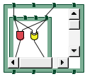

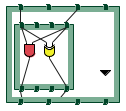

### Ghost Image Figure

Semi-transparent ghost image figures now be easily created for arbitrary Draw2d figures, e.g. to render feedback.

### Clipping Strategy

Draw2d figures can now be parameterized with a clipping strategy (IClippingStrategy) to establish custom clipping behavior for their children. If no clipping strategy is provided, the default clipping behavior prior to 3.6 is applied, i.e. child figures are clipped at their parent's client area.

As this default clipping behavior leads to quite poor results in case connections are drawn from nested viewports ...

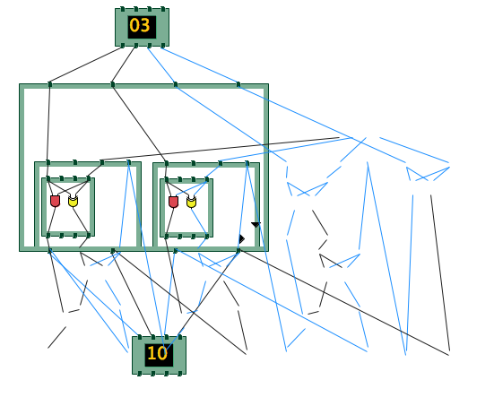

... a clipping strategy implementation (ViewportAwareConnectionLayerClippingStrategy) to deal with this is now available, being the default clipping strategy of the logic editor's ConnectionLayer.

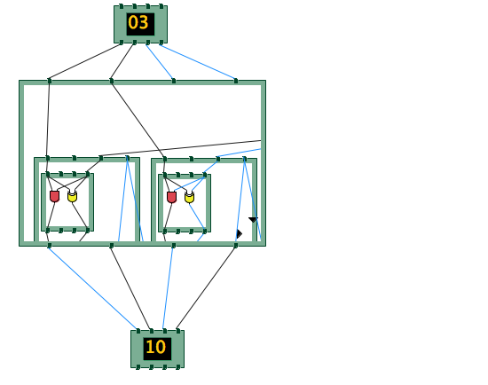

## GEF

### Scrollable Selection Feedback

GEF now offers a special SelectionEditPolicy to render the hidden contents of a viewport by means of semi-transparent ghost images for the nested children and related connections. That is, in case the ScrollableFeedbackSelectionPolicy is registered at a host edit part, the hidden contents can now be easily made visible by a primary selection of the host figure.

# [GEF 3.5.0 (Galileo)](https://projects.eclipse.org/projects/tools.gef/releases/3.5.0-9)

## Draw 2D

### LineBorder supports line style

LineBorder now provides getter and setter methods for line style, and a new constructor that allows specifying this new attribute. Paint method is also updated to take line style into account. If line style is not specified, the default value is used, which is solid line style.

### Support the new SWT Line Attribute and fractional line widths

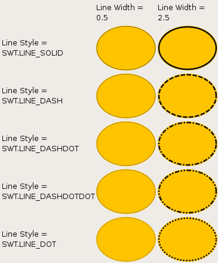

### Graphics now implements getAdvanced()

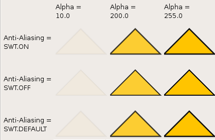

## Zest

### Curved Connections

Zest now supports curved connections between nodes. This can be set by calling setDepth(int) on a GraphConnection.

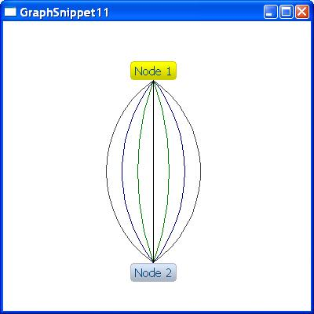

### Nested Content Provider

Zest now supports nested graphs through the use of a content provider. A snippet showing this is available here.

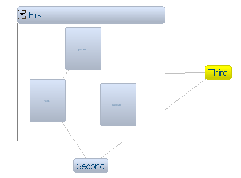

# [GEF 3.0.0](https://projects.eclipse.org/projects/tools.gef/releases/3.0.0)

## Rulers and Guides

GEF viewers can now display accessible rulers along their top and left edges. A ruler can display pixels, centimeters or inches. Guides can be created on the ruler by clicking on an empty spot on the ruler or via its context menu. Parts in the graphical editor can be dragged and attached to the guides. They can also be attached when resizing. Alternatively, snapping can be disabled by holding down the Alt key while dragging. Feedback is shown in the form of a red line when a part is being attached to a guide.

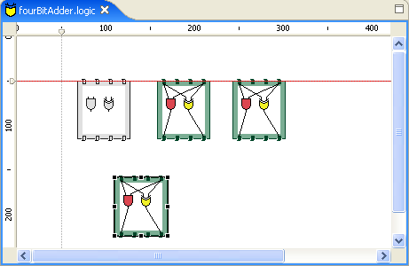

Parts that are attached to a guide will then move with the guide.

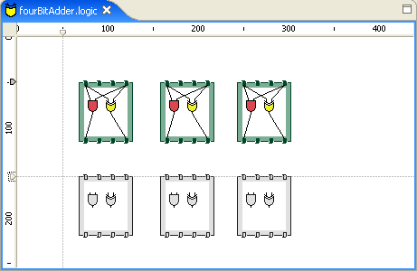

A mechanism is available to show or hide rulers.

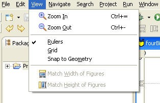

## Grid

GEF now provides a grid. Parts can be snapped to a grid during creation, moving or resizing. It is also possible to have connection bendpoints snap to it. (Note that snapping during creation and snapping of connection bendpoints, although possible, have not been implemented in the logic example.) Alternatively, snapping can be disabled by holding down the Alt key while dragging. Grid snapping and visibility are two distinct properties, and it is possible to enable one without the other. Like the rulers, the grid can be turned off, if so desired.

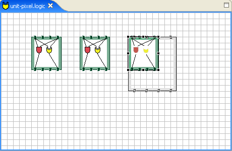

## Snap to Geometry

The Snap to Geometry feature allows you to quickly align parts being dragged to other parts in the diagram. Edges of parts being resized can be snapped as well. A blue feedback line shows what the part is snapping to. In the screenshot below, the circuit being dragged is aligning to the vertical center of the topmost circuit, and the bottom of the other two circuits.

As with the other snapping features, it can be disabled by holding down Alt while dragging, or can be permanently turned off.

## Constrained Move and Resize

Holding down the Shift key while moving a part will restrict that part's movement to one of the primary eight directions (N, S, E, W and the intermediaries). Doing the same while resizing will cause a proportionate resize: the height to width ratio will be maintained.

## Centered Resize

Holding down the Ctrl key while resizing will cause a resize to happen in the opposite direction of the drag as well, such that the center of the part being resized will not change after the resize is done. 

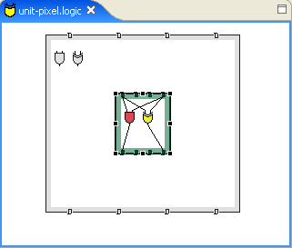

## Cloning

Holding down the Ctrl key while dragging activates cloning. Instead of moving the parts being dragged, copies of those parts will be created at the new location.  During cloning, the cursor will also change to indicate creation.

## Palette View

GEF 3.0 introduces the Palette View. This allows users to customize the size and placement of the palette, and even close it when not needed. Moreover, that size and placement remains the same between multiple GEF-based editors.

## Fly-out Palette

For clients that require the palette to be always visible, and to provide further customizability to the end-user, the fly-out palette is also being introduced. The palette flies out over the top of the editor when the user hovers over it (or clicks on it), and auto-hides when not in use.

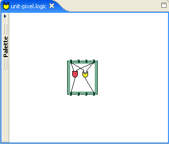

The user can also pin it open, if so desired.

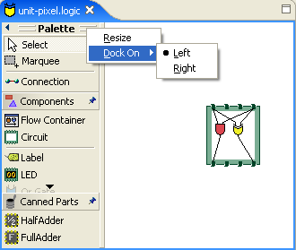

It can be resized, docked on either size of the editor, and is completely accessible. The fly-out is only visible when the palette view is not. It automatically comes up when the palette view is closed (or when the user switches to a perspective in which the view is not open), and disappears when the palette view is opened. The palette state (selection, drawer expansion, etc.) is maintained when switching from the view to the fly-out and vice-versa.

## Palette Stacks

It is now possible to create stacks of entries on the palette. The active entry in the stack is the one visible on the top. A drop-down menu allows changing the active entry. When the palette is in any layout other than list, the drop-down can only be accessed via Alt+Down.

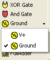

## Shortest Path Connection Routing

An automatic connection routing technique, that employs the shortest path algorithm to find paths around obstacles, is now available in GEF.

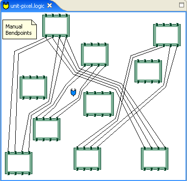

This feature can be activated in the logic example by deselecting everything in the diagram and then changing the connection router via the property sheet.

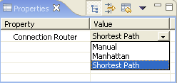

## Panning

With the PanningSelectionTool, it is possible to pan by moving the mouse while holding down spacebar and mouse button 1 (left mouse button). This is demonstrated in the logic example, which uses the PanningSelectionTool as the default tool, instead of the SelectionTool.

## Match Size of Figures

New actions are available that can, with more than one part selected, resize all selected parts to have the same height or width as that of the primary selection (the part that was last selected).

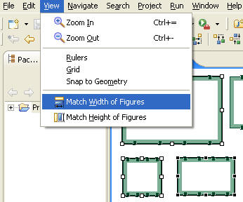
