# About

Zest: The Eclipse Visualization Toolkit

This repo contains the latest version of Zest that is compatible with [GEF classic](https://github.com/eclipse/gef-classic/wiki), including new subgraph rendering, layout algorithms, Graphviz DOT support and [Cloudio](https://github.com/eclipse/gef/wiki/Cloudio-User-Guide) word cloud visualization.

# Zest 1.x

Documentation on Zest 1.x, the latest released version of Zest in GEF classic, can be found on the [GEF classic wiki](https://github.com/eclipse/gef-classic/wiki).

# Zest 2.x

## Contribute

The latest GEF-classic Zest 2 source code is available this repo (https://github.com/fsteeg/zest).
After cloning and importing the Zest projects in Eclipse, load the Zest target platform using the
[zest.target](https://github.com/fsteeg/zest/blob/master/org.eclipse.zest.feature/zest.target)
file. There are example snippets in *org.eclipse.zest.examples* and
tests in *org.eclipse.zest.tests*. To build a p2 repository and run the
tests with Tycho, run Maven 3 in the local Git repository root:

```
mvn clean install
```

You can also skip running the tests:

```
mvn -Dskip-tests=true clean install
```

To contribute to Zest 2, create a branch in your local Git repository
for working on your changes, e.g. a fix for :

```
git checkout -b fix-issue-111
```

Test, fix, and commit until you're done. Run the build to make sure
everything works. Then push the branch to your fork and open a pull request.

## New subgraph rendering

In Zest 2, subgraphs can hide their contained nodes or add different
types of additional information about *pruned* elements:

### LabelSubgraph

Each subgraph is represented as a separate graph item: a label showing
the number of nodes contained within it. It can be subclassed to show
other kinds of information.

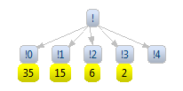

### TriangleSubgraph

Each subgraph is represented as a triangle. It's designed specifically
to work with *SpaceTreeLayoutAlgorithm* (see below) and assumes that
nodes *pruned* inside it form a tree structure. Properties of this
structure are visualized by properties of the triangle. The height of
the triangle corresponds to the height of the tree, the length of the
triangle's base corresponds to the total number of leaves in the tree
and the luminance of the triangle's color corresponds to the average
number of children for each node in the tree (which can be understood as
the density).

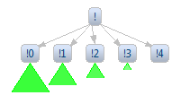

### PrunedSuccessorsSubgraph

Each subgraph is represented as a little label showing how many direct
successors are *pruned*.

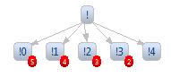

## New layout algorithms

### SpaceTreeLayoutAlgorithm

*SpaceTreeLayoutAlgorithm* keeps track of node positions all the time,
always trying to form a nice tree structure. This means movement of
nodes with the mouse is somehow restricted (you can move a node within
its current layer, but only if it doesn't cause nodes to be pushed out
of the graph area. When an *expand* operation is requested on a node,
the node is centered and its subtree is shown, as long as there's enough
space (other parts of the tree can be collapsed to extend available
space).


### DirectedGraphLayoutAlgorithm

*DirectedGraphLayoutAlgorithm* was designed with the [PDE Dependency
Visualization](http://www.eclipse.org/pde/incubator/dependency-visualization/index.php)
in mind and is based on its layout algorithm. Initially only nodes
without predecessors are *expanded*. Other nodes become visible if they
have at least one direct predecessor which is visible and *expanded*.
*Collapsed* nodes can have outcoming connections if the target node is
visible because of a predecessor. There's an option to hide such
connections.


## Graphviz DOT support

### UI

In Zest 2, graphs can be created from DOT input. For instance, for the
following DOT input, the Zest graph below is drawn, see also the
complete documentation below. The
Zest graph view can be used with the included DOT editor to visualize a
DOT file or to display embedded DOT in other files, e.g. [in source code
comments](http://fsteeg.wordpress.com/2010/01/07/visual-textual-documentation-with-dot-and-zest-in-eclipse/)
or [in wiki
markup](http://fsteeg.wordpress.com/2010/02/07/diagrams-in-wiki-markup-with-mylyn-wikitext-dot-and-zest/).

```
digraph simple { 
 n1[label="Node 1"]
 n2[label="Node 2"]
 n1 -> n2[style=dotted label="A dotted edge"]
}
```


### Subgraphs

Cluster subgraphs in DOT input are rendered as Zest graph containers,
e.g.:

```
digraph subgraphs {
  subgraph cluster1 { 1 -> 2; 2 -> 3; 2 -> 4 }
  subgraph cluster2 { a -> b; a -> c; a -> d }
}
```


### API

Using the API, DOT can be imported to Zest graphs, and Zest graphs can
be exported to DOT (see below). To use the API, create a new Plug-in
project and add *org.eclipse.zest.dot.core* to the MANIFEST.MF
dependencies.

```java
DotGraph graph = new DotGraph("digraph{ 1->2 }", shell, SWT.NONE);
graph.add("2->3").add("2->4");
graph.add("node[label=zested]; edge[style=dashed]; 3->5; 4->6");
System.out.println(graph.toDot());
```

The complete sample usage is [available in the
repository](https://github.com/fsteeg/zest/tree/master/org.eclipse.zest.tests/src/org/eclipse/zest/tests/dot/SampleUsage.java),
as well as [DOT input
samples](https://github.com/fsteeg/zest/tree/master/org.eclipse.zest.tests/resources/tests).

## Migration from Zest 1.x to Zest 2.x

In Zest 2, the layout API has been reworked. Most code should keep
working just fine. See the Javadoc of the deprecated API for
documentation on migrating to the new API. In a few cases however, code
changes are required.

### Layout Filters

Instead of *org.eclipse.zest.layouts.Filter* use
*org.eclipse.zest.core.widgets.LayoutFilter* (see example below and full
code in
[GraphSnippet8.java](https://github.com/fsteeg/zest/tree/master/org.eclipse.zest.examples/src/org/eclipse/zest/examples/swt/GraphSnippet8.java)
in the examples bundle).

```java
LayoutFilter filter = new LayoutFilter() {
  public boolean isObjectFiltered(GraphItem item) {
    if (item instanceof GraphConnection) {
      GraphConnection connection = (GraphConnection) item;
      Object data = connection.getData();
      if (data != null && data instanceof Boolean) {
        return ((Boolean) data).booleanValue();
      }
      return true;
    }
    return false;
  }
};
```

### Custom Layouts

To define custom layouts, instead of extending *AbstractLayoutAlgorithm*
implement *LayoutAlgorithm* (see example below and full code in
[CustomLayout.java](https://github.com/fsteeg/zest/tree/master/org.eclipse.zest.examples/src/org/eclipse/zest/examples/swt/CustomLayout.java)
in the examples bundle).

```java
LayoutAlgorithm layoutAlgorithm = new LayoutAlgorithm() {
  private LayoutContext context;
  public void setLayoutContext(LayoutContext context) {
    this.context = context;
  }
  public void applyLayout(boolean clean) {
    EntityLayout[] entitiesToLayout = context.getEntities();
    int totalSteps = entitiesToLayout.length;
    double distance = context.getBounds().width / totalSteps;
    int xLocation = 0;
    for (int currentStep = 0; currentStep < entitiesToLayout.length; currentStep++) {
      EntityLayout layoutEntity = entitiesToLayout[currentStep];
      layoutEntity.setLocation(xLocation,
      layoutEntity.getLocation().y);
      xLocation += distance;
    }
  }
};
```

### Connection Style Providers

The *IConnectionStyleProvider* and *IEntityConnectionStyleProvider*
interfaces now contain *getRouter* methods returning an
*org.eclipse.draw2d.ConnectionRouter*. Return *null* for the default
router. See
[ManhattanLayoutJFaceSnippet.java](https://github.com/fsteeg/zest/tree/master/org.eclipse.zest.examples/src/org/eclipse/zest/examples/jface/ManhattanLayoutJFaceSnippet.java)
in the examples bundle.

# DOT for Zest

This Eclipse feature provides support for the
[Graphviz](http://www.graphviz.org/) [DOT
language](http://www.graphviz.org/doc/info/lang.html) in [Zest: The
Eclipse Visualization Toolkit](http://www.eclipse.org/gef/zest/), both
as an input and output format. It provides API und UI elements to
transform both DOT graphs to Zest visualizations (to be used in Java SWT
applications), and Zest visualizations to DOT graphs (to be rendered as
image files with Graphviz).


## User Documentation

### GUI

This feature adds a DOT editor and a Zest graph view to the UI:


#### Zest Graph View

The Zest Graph view can visualize DOT graphs in \*.dot files or embedded
in other files in the workspace. The view draws the DOT graphs using
Zest and allows for image export of the current Zest graph. When
automatic updating is enabled (see below), and a \*.dot file or embedded
DOT content is added to the workspace or altered in an editor, the Zest
graph view is updated with the graph created from the DOT input. For
instance, consider a file with the .dot extension, containing the
following DOT graph definition:

```
digraph s{ 
 n1[label="Node 1"]; n2[label="Node 2"]; 
 n1 -> n2[style=dotted label="A dotted edge"]
}
```

The view will display:


The view contains buttons to toggle automatic updates, to load a
specific file containing a DOT graph, and to layout the current graph.
To export the current Zest graph as an image file by calling the *dot*
executable, the view contains buttons to re-select the directory
containing the *dot* executable, to enable export of the original DOT
input, and to export as an image file (from left to right). When the
image export button is selected, a PDF for the current graph is saved in
the directory containing the file with the DOT input, and opened with
the associated external editor, if one is available. In this example,
the export looks like this:

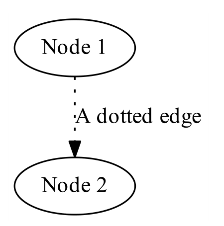

This provides a Zest-based DOT authoring environment. If a \*.dot file
or embedded DOT is edited, it will be visualized in the Zest Graph view
(e.g. during editing), and can be exported as a PDF with Graphviz.

At the same time the view provides a simple way to visualize \*.dot file
output of any kind of program, e.g. to visualize and debug internal data
structures, results, etc: if a program running in Eclipse outputs any
\*.dot file in the workspace and the workspace is refreshed, the view
will be updated with the corresponding Zest graph (if automatic updating
is enabled, see above).

#### Editing

The Zest view can be used with the included DOT editor to visualize a
DOT file:


Additionally, the Zest view also displays embedded DOT in other files,
e.g. [in source code
comments](http://fsteeg.wordpress.com/2010/01/07/visual-textual-documentation-with-dot-and-zest-in-eclipse/)
or [in wiki
markup](http://fsteeg.wordpress.com/2010/02/07/diagrams-in-wiki-markup-with-mylyn-wikitext-dot-and-zest/):


### API

Via the API, DOT can be imported to Zest graph instances, and Zest graph
instances can be exported to DOT.

To use the API, create a new Plug-in project, add
*org.eclipse.zest.dot.core* to the MANIFEST.MF dependencies, paste the
code below into the source folder of the created project, and select
*Run As \> Java Application*:

```java
import org.eclipse.swt.SWT;
 import org.eclipse.swt.layout.FillLayout;
 import org.eclipse.swt.widgets.Display;
 import org.eclipse.swt.widgets.Shell;
 import org.eclipse.zest.dot.DotGraph;
 
 public class SampleUsage {
 
   public static void main(String[] args) {
     Shell shell = new Shell();
     DotGraph graph = new DotGraph("digraph{ 1->2 }", shell, SWT.NONE);
     graph.add("2->3").add("2->4");
     graph.add("node[label=zested]; edge[style=dashed]; 3->5; 4->6");
     open(shell);
     System.out.println(graph.toDot());
   }
 
   private static void open(final Shell shell) {
     shell.setText(DotGraph.class.getSimpleName());
     shell.setLayout(new FillLayout());
     shell.setSize(600, 300);
     shell.open();
     Display display = shell.getDisplay();
     while (!shell.isDisposed())
       if (!display.readAndDispatch())
         display.sleep();
     display.dispose();
   }
 }
```

The complete sample usage is [available in the
repository](https://github.com/fsteeg/zest/tree/master/org.eclipse.zest.tests/src/org/eclipse/zest/tests/dot/SampleUsage.java),
as well as [DOT input
samples](https://github.com/fsteeg/zest/tree/master/org.eclipse.zest.tests/resources/tests).

### Layouts

#### DOT import

During import of DOT graphs into Zest, the DOT layout specified in the
input is mapped to the most suitable Zest layout algorithm - e.g. for
the following DOT graph:

```
graph { 1--2--3; 2--4--5 }
```

If the graph defines a Graphviz layout, it is mapped to a Zest layout as
below:

```
graph[layout=dot]
```

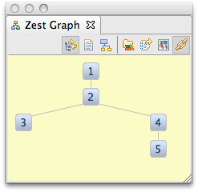

```
graph[layout=fdp];
```

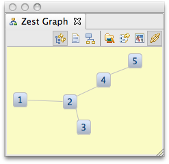

```
graph[layout=twopi];
```

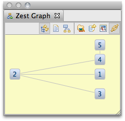

```
graph[layout=osage];
```

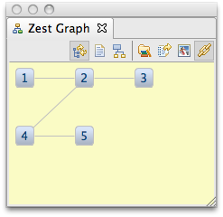

#### DOT export

When Zest graphs are exported to DOT (whether created from DOT or not),
the most suitable Graphviz layout is choosen, e.g.:

```java
graph.setLayoutAlgorithm(new TreeLayoutAlgorithm(), false); graph.toDot();
```

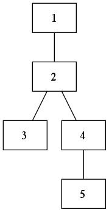

```java
graph.setLayoutAlgorithm(new SpringLayoutAlgorithm(), false); graph.toDot();
```

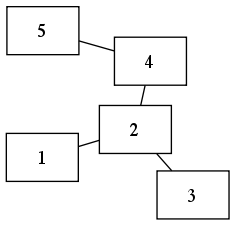

```java
graph.setLayoutAlgorithm(new RadialLayoutAlgorithm(), false); graph.toDot();
```


```java
graph.setLayoutAlgorithm(new GridLayoutAlgorithm(), false); graph.toDot();
```

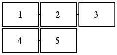

### Subgraphs

Cluster subgraphs imported to a Zest Graph instance are rendered as Zest
graph containers, e.g.:

```
digraph subgraphs {
  subgraph cluster1 { 1 -> 2; 2 -> 3; 2 -> 4 }
  subgraph cluster2 { a -> b; a -> c; a -> d }
}
```


Cluster subgraphs can be labeled and can define their own layouts, e.g.:

```
digraph agent {
  subgraph cluster1 { label = "the agent likes martinis"
    S -> NP; NP -> the; NP -> agent; S -> VP; VP -> likes; VP -> martinis
  }
  subgraph cluster2 { label = "martinis"; rankdir = LR
    martinis -> pos; martinis -> number; martinis -> semantics; martinis -> grammar
    pos -> noun; number -> plural; semantics -> patient; grammar -> object
  }
}
```


## Developer Documentation

The goal of this feature is to implement the
[Graphviz](http://www.graphviz.org/) [DOT
language](http://www.graphviz.org/doc/info/lang.html) as a
domain-specific language (DSL) for [Zest: The Eclipse Visualization
Toolkit](http://www.eclipse.org/gef/zest/), both as an input and output
format. In other words, the goal is to transform both DOT graphs to Zest
visualizations (to be used in Java SWT applications), and Zest
visualizations to DOT graphs (to be rendered as image files with
Graphviz).

This feature started as a [project](https://fsteeg.wordpress.com/2009/08/17/graphviz-dot-for-eclipse-zest/)
in the Google Summer of Code 2009 by Fabian Steeg, mentored by Ian Bull, for Zest.

### Resources


The main bug for this feature is [277380](https://bugs.eclipse.org/bugs/show_bug.cgi?id=277380). View a [complete
list](https://bugs.eclipse.org/bugs/buglist.cgi?query_format=specific&order=relevance+desc&bug_status=__all__&product=GEF&content=%5Bdot4zest%5D)
of related bugs. If you have suggestions for this feature you can [file
a new
bug](https://bugs.eclipse.org/bugs/enter_bug.cgi?bug_file_loc=http%3A%2F%2Fwiki.eclipse.org%2FGraphviz_DOT_as_a_DSL_for_Zest&bug_severity=enhancement&bug_status=NEW&comment=&component=Zest&contenttypeentry=&contenttypemethod=autodetect&contenttypeselection=text%2Fplain&data=&description=&flag_type-1=X&flag_type-2=X&flag_type-6=X&form_name=enter_bug&maketemplate=Remember%20values%20as%20bookmarkable%20template&op_sys=All&priority=P3&product=GEF&rep_platform=All&short_desc=%5Bdot4zest%5D%20New%20request%20summary&version=unspecified).
The code for this feature is part of the Zest 2.0 Git repository. The
dot4zest bundles are named *org.eclipse.zest.dot.\**. See the general
instructions above.

After changes to the Xtext grammar, run (Run As -\&gt; MWE2 workflow)
the *GenerateDot.mwe2* in the
*/src/org/eclipse/zest/internal/dot/parser* folder of the core bundle.
Make sure to set the project or workspace encoding to UTF-8.

Run the *All\*.java* test suites of the test bundle
(*org.eclipse.zest.tests*) as JUnit or JUnit Pug-in tests to get an
impression of the current implementation state. To use the UI
components, run an Eclipse application configured with
*org.eclipse.zest.dot.ui* and required plugins. See details on usage in
the user documentation above.

### Motivation

Graphviz is a very popular tool and its DOT language is widely used.
Support for it could make using Zest very easy for many people who are
familiar with DOT.

DOT integration for Zest could also be useful for existing Eclipse tools
that are based on Graphviz, like [TextUML](http://abstratt.com/textuml/)
or [EclipseGraphviz](http://eclipsegraphviz.wiki.sourceforge.net/), and
others, for instance in the [Mylyn rich task
editor](http://tasktop.com/blog/eclipse/rich-editing-for-tasks-via-mylyn-wikitext)
(for [embedding DOT graphs in wiki text markup, visualized with
Zest](http://fsteeg.wordpress.com/2010/02/07/diagrams-in-wiki-markup-with-mylyn-wikitext-dot-and-zest/)).

On the output side, Zest can benefit from Graphviz output as it provides
a way to produce high-quality export into different file formats, e.g.
for printing Zest visualizations, or using them in digital publications.

### Implementation

The dot4zest functionality is implemented based on [Eclipse
Modeling](http://www.eclipse.org/modeling/) technologies, in particular
[Xtext](http://wiki.eclipse.org/Xtext) (part of
[TMF](http://www.eclipse.org/modeling/tmf)) for the input part (parse
DOT, generate Zest) and [JET](http://wiki.eclipse.org/M2T-JET) for the
output (see details below).


#### DOT to Zest

Based on an Xtext grammar, dot4zest interprets the parsed DOT EMF model
using the generated Xtext switch API to dynamically create Zest graphs.
The Zest graph view uses this to display DOT with Zest (see above).

#### Zest to DOT

To transform Zest graph instances to the Graphviz DOT language dot4zest
uses [JET](http://wiki.eclipse.org/M2T-JET).

There are two reasons to use JET instead of Xpand here. First, this
allows us to transform any Zest graph instance to DOT directly (not only
those for which we have a DOT meta model instance that could act as the
input to Xpand).

Second, even if we had a DOT meta model instance (which we could create
from the Zest graph), using Xpand would introduce a runtime dependency
on the [Modeling Workflow
Engine](http://wiki.eclipse.org/Modeling_Workflow_Engine_\(MWE\)),
whereas with JET we only introduce a dependency on a single class (the
generator class JET created from the template).

### Future Ideas

  - Add support for different Graphviz shapes through [Zest custom
    figures](http://eclipsesource.com/blogs/2009/03/20/just-in-time-for-eclipsecon-custom-figures-in-zest/),
    e.g. for UML class diagrams
  - Add support to visualize Graphviz subgraphs as separate Zest graphs
    that can be accessed from the main graph
  - Look into possible ways of supporting Graphviz edge decorators (open
    or closed arrows, diamonds, etc.)
  - Map all graph, node and edge attributed from DOT input to
    corresponding Zest widget data (currently supported for graph
    attributes)
  - Add animation support using something like *subgraph
    cluster\_animation\_1 { label = "Step 1"; 1-\>2 }* etc., where
    animation steps are represented as subgraphs in the DOT input (which
    if rendered with Graphviz results in a static description of the
    animation)

For instance, for the input below a Zest animation could be created that
changes like this (this is an experimental illustation of the idea):

```
digraph SampleAnimation {
 /* We can specify a Zest layout for the animation here: */
 layout=tree // = TreeLayoutAlgorithm
 /* Global attributes can be defined for edges and nodes: */
 node[label="Node"]
 edge[label="Edge" style=dotted]
 1;2;3;4;5
 /* The single animation steps are marked by numbers: */
 subgraph cluster_animation_0{ 1 -> 2 [label="Dashed" style=dashed]}
 subgraph cluster_animation_1{ 1 -> 3 }
 subgraph cluster_animation_2{ 3 -> 4; 3 -> 5}
}
```

After the first step:


And the final state of the graph:


The same input file, exported with Graphviz, shows the animation steps
as subgraphs:


A possible use case for defining such animations with DOT is to easily
create animated documentation, e.g. to explain data structures. The same
file defining the animation could be used to export a PDF illustrating
the steps in a static way.

# Resources

General documentation is available on the [Eclipse wiki](http://wiki.eclipse.org/Zest). You can report issues in the [Eclipse Bugzilla](https://bugs.eclipse.org/bugs/enter_bug.cgi?component=Zest&product=GEF). You can get help in the [Eclipse community forums](http://www.eclipse.org/forums/eclipse.tools.gef) or on [Stack Overflow](http://stackoverflow.com/questions/ask).