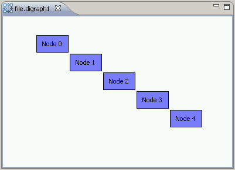
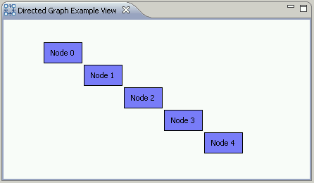
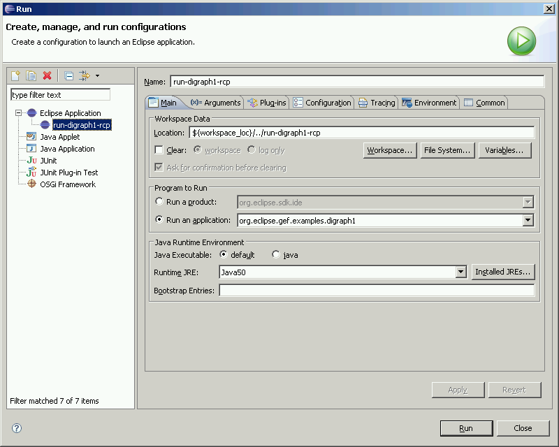
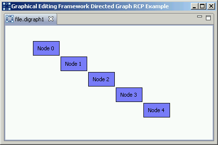

# Graphical Editing Framework (GEF) Directed Graph Example (Digraph1)

## Getting the source for the example

[A team project set file for the digraph1 example is here](http://www.eclipse.org/gef/reference/digraph1.psf). Download the team project set file and do the following to import the plug-in project into your workspace.

- From the File menu, choose Import. This will open the Import dialog.
- In the Import dialog, choose Team > Team Project Set and click Next.
- Browse for or type in the name of the project set file and click Finish.
- The digraph1 project contained in the project set will be fetched from the CVS repository on Eclipse.org. 

The example was created with [Eclipse 3.3](http://download.eclipse.org/downloads) and [GEF 3.3](http://download.eclipse.org/tools/gef/downloads)

## Basic Graphical Editor

The main objective of the digraph1 example was to provide a simple graphical editor that demonstrates GEF's Model-View-Controller (MVC) architecture. This first directed graph example is as simple as it gets.

### Model

The model is a simple graph ( _Digraph1Graph_ ) with a number of nodes ( _Digraph1Node_ ). In this simple example the graph has a fixed number of nodes and a fixed location for each node in the graph.

### Figure

We define the view to display the graph using figures. The figure for the graph is simply a  _FreeformLayer_ . Each node figure is a  _Digraph1NodeFigure_ .

### EditPart

We bridge the model and view with the controller, or EditPart. We have an EditPart for the graph and each node ( _Digraph1GraphEditPart_  and  _Digraph1NodeEditPart_ ).

### Factory

The graphical viewer has an edit part factory ( _Digraph1EditPartFactory_ ) to create new EditParts for the example.

### Policy

We make use of a  _XYLayoutEditPolicy_  to place the nodes on the graph ( _Digraph1XYLayoutEditPolicy_ ).

### Editor

Finally, we use an editor with no editing functionality to display the graphical viewer ( _Digraph1GraphicalEditor_ ).

### Opening the Example Editor

The graph example editor opens for any file with the digraph1 file extension. So we need a project and file in the workspace to open the editor. First, create a new project resource  _File > New > Project_ . Then a new file resource, such as file.digraph1 using  _File > New > File_ . After creating the file, the  _Directed Graph Example Editor_  will open.

## Graphical View

Most frequently, GEF is used to graphically display your model in an Eclipse editor. However, GEF's viewers can also be used in views, dialogs, or just about anywhere you can place a control.

The digraph1 example hosts the same content from the editor in a view. The code in the  _Digraph1GraphicalView_  is exactly like the content in the GraphicalEditor.

To open the view, select  _Window > Show View > Other_  and select the  _Directed Graph Example View_  from the  _Other_  category.

## Graphical Editor in a RCP Application

The  _org.eclipse.gef.examples.digraph1.rcp package_  provides the four classes required to put the graphical editor in a RCP application.

The RCP application can be directly started by running an Eclipse application from  _Run > Open Run Dialog..._  A new configuration can be created as below:

Our WorkbenchWindowAdvisor works by creating a dummy file in a project. Since our example loads from a static model, the editor opens when the RCP application starts.

