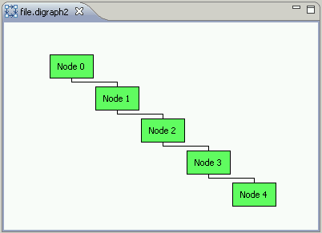

# Graphical Editing Framework (GEF) Directed Graph Example (Digraph2)

## Getting the source for the example

[A team project set file for the digraph1 example is here](http://www.eclipse.org/gef/reference/digraph2.psf). Download the team project set file and do the following to import the plug-in project into your workspace.

- From the File menu, choose Import. This will open the Import dialog.
- In the Import dialog, choose Team > Team Project Set and click Next.
- Browse for or type in the name of the project set file and click Finish.
- The digraph2 project contained in the project set will be fetched from the CVS repository on Eclipse.org. 

The example was created with [Eclipse 3.3](http://download.eclipse.org/downloads) and [GEF 3.3](http://download.eclipse.org/tools/gef/downloads)

## Basic Graphical Editor with Connections

The objective of the digraph2 example is to add connections to the digraph1 example.

### Model

We add edges ( _Digraph2Edge_ ) to our domain model.

### Figure

Each edge figure is a  _PolylineConnection_ . We also add  _Digraph2ConnectionAnchor_ to anchor the edges to the nodes. The edges are anchored to the bottom center and top center of the nodes.

### EditPart

We add an EditPart for edges ( _Digraph2EdgeEditPart_ ). We also need to make  _Digraph2NodeEditPart_  implement  _NodeEditPart_  to add source and target connections to the nodes in our directed graph. We finally added a  _ManhattanConnectionRouter_  to the  _ConnectionLayer_  in the  _refreshVisuals()_  method in our  _Digraph2GraphEditPart_ .

### Factory

We add  _Digraph2EdgeEditPart_  to  _Digraph2EditPartFactory_ .

### Policy

We make use of a  _ConnectionEditPolicy_  to place the edges on the graph ( _Digraph2ConnectionEditPolicy_ ).

### Editor

We did not need to make any additional changes to our  _Digraph2GraphicalEditor_ .

### Opening the Example Editor

The graph example editor opens for any file with the  _digraph2_  file extension. So we need a project and file in the workspace to open the editor. First, create a new project resource  _File > New > Project_ . Then a new file resource, such as  _file.digraph2_  using  _File > New > File_ . After creating the file, the  _Directed Graph Example Editor_  will open.